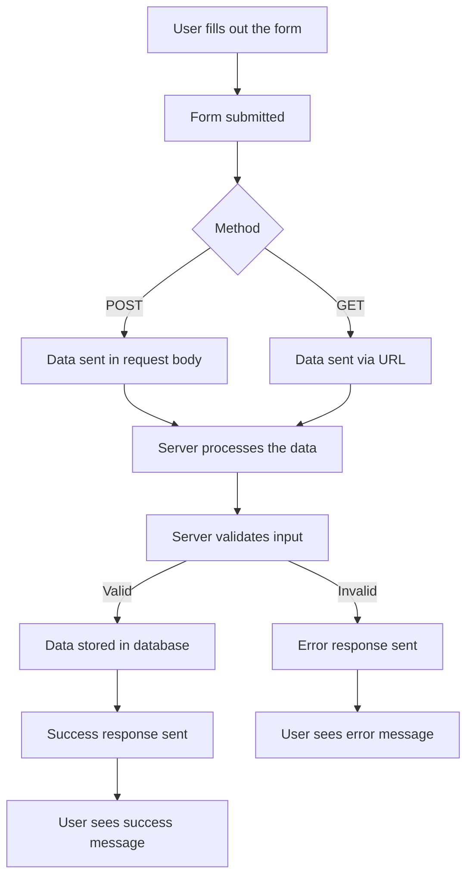
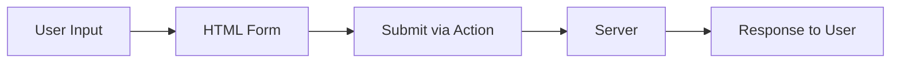

# HTML Forms and Processing: Beginner's Guide

---

## Slide 1: Introduction to HTML Forms

### Key Points:

- **What is a Form?**
    - An HTML element to collect user input and send it to a server for processing.
- **Purpose of Forms**:
    - Collect data (e.g., login details, registration info, search queries).
    - Trigger server-side actions.

### Basic Syntax:

```html
<form action="/submit" method="POST">
  <label for="username">Username:</label>
  <input type="text" id="username" name="username" required>
  <button type="submit">Submit</button>
</form>
```

## Slide 2: Form Attributes

### Key Form Attributes:

- **`action`**:
    - URL where form data is sent for processing.
    - Example: `action="/submit"`
- **`method`**:
    - HTTP method used to send data.
    - Common values: `GET`, `POST` (also `PUT`, `PATCH`, `DELETE` with workarounds).

### Example:

```html
<form action="/login" method="POST">
  <!-- Input fields here -->
</form>
```

## Slide 3: HTTP Methods in Forms

### **GET**

- Data is appended to the URL.
- Used for fetching or retrieving resources.
- Example:
    
    ```html
    <form action="/search" method="GET">
      <input type="text" name="q" placeholder="Search">
      <button type="submit">Search</button>
    </form>
    ```
    
- URL Example: `/search?q=example`

### **POST**

- Data is sent in the request body.
- Used for creating or updating resources.

### Workarounds for Other Methods:

- Use hidden inputs or JavaScript for `PUT`, `PATCH`, `DELETE`.

---

## Slide 4: Types of Form Data Encoding

### **1. application/x-www-form-urlencoded (Default)**

- Data is encoded as key-value pairs.
- Spaces replaced with `+` or `%20`.
- Example:
    
    ```makefile
    username=johndoe&password=1234
    ```
    

### **2. multipart/form-data**

- Used for uploading files.
- Each field is sent as a separate part of the request body.

### **3. application/json (Custom via JavaScript)**

- Data is sent as a JSON object.
- Example:
    
    ```json
    {
      "username": "johndoe",
      "password": "1234"
    }
    ```
    

---

## Slide 5: Serialization and Deserialization

### **Serialization**

- Converting form data into a format suitable for transmission (e.g., JSON, URL-encoded).
- Example (JavaScript):
    
    ```jsx
    const form = document.querySelector('form');
    const formData = new FormData(form);
    const serializedData = Object.fromEntries(formData.entries());
    console.log(serializedData);
    ```
    

### **Deserialization**

- Converting transmitted data back into usable objects or structures.
- Example:
    
    ```jsx
    const receivedData = '{"username":"johndoe","password":"1234"}';
    const deserializedData = JSON.parse(receivedData);
    console.log(deserializedData);
    ```
    

---

## Slide 6: Encoding and Decoding

### **Encoding**

- Transforming data for safe transmission.
- Example (URL Encoding):
    
    ```jsx
    const encoded = encodeURIComponent('hello world'); // "hello%20world"
    ```
    

### **Decoding**

- Reverting encoded data back to its original form.
- Example:
    
    ```jsx
    const decoded = decodeURIComponent(encoded); // "hello world"
    ```
    

---

## Slide 7: Encryption and Decryption

### **Encryption**

- Protecting data by converting it into an unreadable format using a key.
- Example:
    
    ```jsx
    const encrypted = btoa('myPassword'); // "bXlQYXNzd29yZA=="
    ```
    

### **Decryption**

- Reversing encryption to get the original data.
- Example:
    
    ```jsx
    const decrypted = atob(encrypted); // "myPassword"
    ```
    

---

## Slide 8: Form Data Processing Workflow



---

## Slide 9: Best Practices

1. Always validate form data both on the client and server side.
2. Use HTTPS to encrypt data in transit.
3. Protect against CSRF attacks when using POST requests.
4. Provide user-friendly feedback and error handling.
5. Keep forms accessible with proper labels and ARIA attributes.

---

## Slide 10: Summary

- Forms are essential for collecting and processing user data.
- Understand `action`, `method`, and encoding types.
- Use serialization/deserialization for handling data.
- Employ encryption for secure data transmission.
- Follow best practices to ensure security and usability.

---

## Diagram: Simplified Flow



---

**Thank you!**